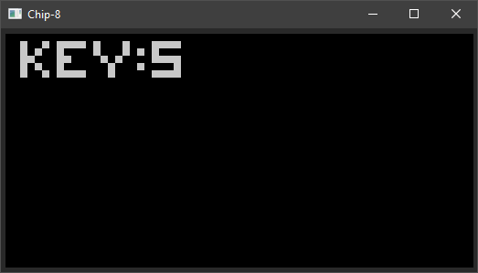

# chip8 - CHIP-8 Emulator

This is a CHIP-8 emulator written in Rust.
The goal of this project is to write a composable CHIP-8 system without
a hard dependency to the display and sound backends.

This is achieved through the use of a IO port abstraction where the main
system is connected to external virtual components (keyboard, screen, beeper).

As of now, the keyboard and screen are implemented using the [druid](https://crates.io/crates/druid) GUI library.

The beeper component uses the [cpal](https://crates.io/crates/cpal) library.

## Usage

    USAGE:
        chip8.exe [FLAGS] [OPTIONS] <FILENAME>
    
    ARGS:
        <FILENAME>    Set input filename of the image to run
    
    FLAGS:
        -h, --help                    Print help information
        -l, --load-store-ignores-i    Load and store instructions do not increment the I register
        -s, --shift-reads-vx          Shift operations read the VX register instead of VY
        -V, --version                 Print version information
    
    OPTIONS:
        -b, --bg-color <BG_COLOR>
            Set background color for the gui (hex HTML-like RGB color value)

        -c, --cpu-frequency <CPU_FREQUENCY>
            Set CPU frequency (> 0 and < 5000 Hz)

        -f, --fg-color <FG_COLOR>
            Set foreground color for the gui (hex HTML-like RGB color value)

        -k, --kb-profile <KB_PROFILE>
            Set profile mapping physical to virtual keyboard (supported profiles: default, qwerty,
            azerty)

## Assembler

The project also includes a basic assembler, `c8asm`.

Usage:

    $ c8asm input_file output_file

See the included example: [ex.c8asm](examples/ex.c8asm)
