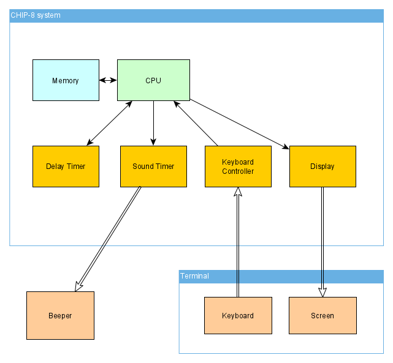

# chip8 - CHIP-8 Emulator

This is a CHIP-8 emulator written in Rust.
The goal of this project is to write a composable CHIP-8 system without
a hard dependency to the display and sound backends.

This is achieved through the use of a IO port abstraction where the main
system is connected to external virtual components (keyboard, screen, beeper).

As of now, the keyboard and screen are implemented using the [druid](https://crates.io/crates/druid) GUI library.

The beeper component uses the [cpal](https://crates.io/crates/cpal) library.

## Usage

        chip8 [FLAGS] <filename>

    ARGS:
        <filename>    Sets the input filename of the image to run
    
    FLAGS:
        -h, --help                Prints help information
        --load-store-ignores-i    Load and store instructions do not increment the I register
        --shift-reads-vx          Shift operations read the VX register instead of VY
        -V, --version             Prints version information

## Assembler

The project also includes a basic assembler, `c8asm`.

Usage:

    $ c8asm input_file output_file

See the included example: [ex.c8asm](examples/ex.c8asm)
